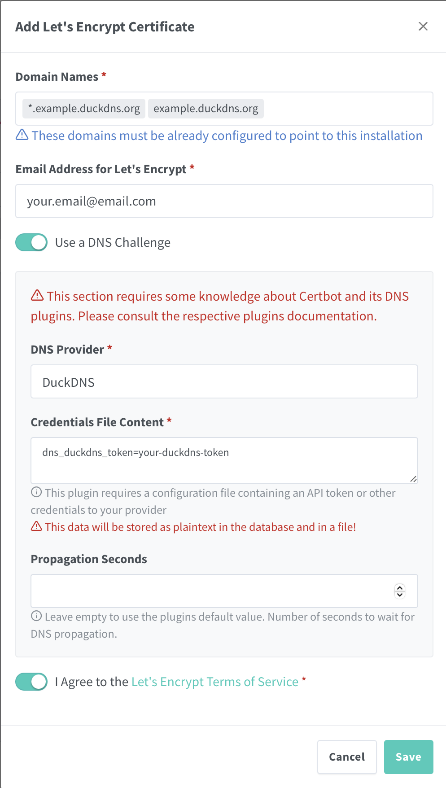
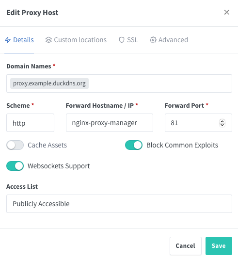

# 📦 Nginx Proxy Manager Docker Compose Stack

[](LICENSE)
[](https://www.docker.com/)
[](https://openzfs.org/)

[](https://tailscale.com)
[](https://nginxproxymanager.com)

This repository provides a self-contained Docker Compose stack to run [Nginx Proxy Manager](https://nginxproxymanager.com/), a modern UI for managing Nginx-based reverse proxies with automatic SSL via Let's Encrypt.

It supports optional ZFS integration for advanced users who wish to mount data volumes onto a ZFS dataset. The stack remains fully usable without ZFS.

---

## 📁 Directory Structure

```bash
tank/
├── docker/
│   ├── compose/
│   │   └── nginx-proxy-manager/    # Git repo lives here
│   │       ├── docker-compose.yml  # Main Docker Compose config
│   │       ├── .env                # Runtime environment variables and secrets (gitignored!)
│   │       ├── env.example         # Example .env file for reference
│   │       ├── README.md           # This file
│   │       └── images/             # Images used in the README.md
│   └── data/
│       └── nginx-proxy-manager/    # Volume mounts and persistent data
```

---

## 🧰 Prerequisites

* Docker Engine
* Docker Compose V2
* Git
* (Optional) ZFS on Linux for dataset management

> ⚠️ **Note:** These instructions assume your ZFS pool is named `tank`. If your pool has a different name (e.g., `rpool`, `zdata`, etc.), replace `tank` in all paths and commands
with your actual pool name.

---

## ⚙️ Setup Instructions

1. **Create the stack directory and clone the repository**

   If using ZFS:
   ```bash
   sudo zfs create -p tank/docker/compose/nginx-proxy-manager
   cd /tank/docker/compose/nginx-proxy-manager
   sudo git clone https://github.com/Vantasin/Nginx-Proxy-Manager.git .
   ```

   If using standard directories:
   ```bash
   mkdir -p ~/docker/compose/nginx-proxy-manager
   cd ~/docker/compose/nginx-proxy-manager
   git clone https://github.com/Vantasin/Nginx-Proxy-Manager.git .
   ```

2. **Create the runtime data directory**

   If using ZFS:
   ```bash
   sudo zfs create -p tank/docker/data/nginx-proxy-manager
   ```

   If using standard directories:
   ```bash
   mkdir -p ~/docker/data/nginx-proxy-manager
   ```

3. **Configure environment variables**

   Copy and modify the `.env` file:

   ```bash
   sudo cp env.example .env
   sudo nano .env
   sudo chmod 600 .env
   ```

> **Note:** You only need to change the `.env` file if you are not using the default storage path.

4. **Create the custom user-defined external network**

   ```bash
   sudo docker network create npm_proxy
   ```


5. **Start Nginx Proxy Manager**

   ```bash
   sudo docker compose up -d
   ```

---


## 🌐 Access Nginx Proxy Manager

Once running, open your browser to:

```
http://localhost:81
```

Or replace `localhost` with your server’s IP address.

### 🔑 Initial Login Credentials

Use the following default credentials to log in for the first time:

- **Email:** `admin@example.com`
- **Password:** `changeme`

> **Note:** For security purposes, make sure to change the default password immediately after logging in.

---

## 🔒 Secure Access with Wildcard SSL & DuckDNS

To expose **Nginx Proxy Manager** over HTTPS on your own DuckDNS domain (e.g. `example.duckdns.org`), follow these steps:

### 1. Create your DuckDNS entry
Sign up at [DuckDNS.org](https://www.duckdns.org/) and create a new subdomain (e.g. `example.duckdns.org`).

> **Note:** if you want to access your  self hosted services outside of your Local Network Area (LAN) without port forwarding you can use a VPN like [Tailscale](https://tailscale.com/download/linux). You simply need to install Tailscale on the host server, create a free account and point your domain to your Host's Tailscale IP.

### 2. Obtain a wildcard Let’s Encrypt certificate
1. In the NPM UI, go to **SSL → Add Let’s Encrypt Certificate**.
2. Under **Domain Names**, enter your `*` wild card and duckdns domains eg.:
`*.example.duckdns.org` & `example.duckdns.org`
3. Supply your email address and toggle **Use a DNS Challenge**.
4. Select **DuckDNS** as the DNS provider and paste your DuckDNS token into **Credentials File Content** ensure there are no extra spaces.
5. Leave **Propagation Seconds** blank (or increase if you see DNS timeout errors).
6. Agree to the Terms and click **Save**.

<p align="center">
  
</p>

> **Tip:** using a wildcard cert means any sub-domain (`foo.example.duckdns.org`, `bar.example.duckdns.org`) will be covered.

> **Note:** you can use any domain you want, we just went with DuckDNS because it is free.

### 3. Add Nginx Proxy Manager itself as a proxy host
1. In the NPM UI, click **Proxy Hosts → Add Proxy Host**.
2. Under **Details**:
    - **Domain Names**: `proxy.example.duckdns.org`
    - **Scheme**: `http`
    - **Forward Hostname / IP**: `nginx-proxy-manager` (the Nginx Proxy Manager container name)
    - **Forward Port**: `81`
3. Switch to the **SSL** tab:
    - Check **Enable SSL**
    - From the **Certificate** dropdown select your `*.example.duckdns.org` certificate
    - Enable **Force SSL** to redirect all HTTP → HTTPS
4. Click **Save**.

> **Note:** After adding the Nginx Proxy Manager admin GUI as a proxy host you should comment out or delete the line `- "81:81" # NPM Admin` in your `docker-compose.yml` file. This means all traffic to your Nginx Proxy Manager admin GUI has to be routed through Nginx Proxy Manager.

<p align="center">
  
</p>

You can now visit your NPM dashboard securely at `https://proxy.example.duckdns.org`

---

## 🙏 Acknowledgments

- [ChatGPT](https://openai.com/chatgpt) for assistance in generating setup scripts and templates.
- [Docker](https://www.docker.com/) for container orchestration and runtime.
- [jc21/nginx-proxy-manager](https://hub.docker.com/r/jc21/nginx-proxy-manager) the official Docker image used in this stack.
- [Nginx Proxy Manager](https://nginxproxymanager.com/) for making reverse proxy management accessible via a clean UI.
- [Tailscale](https://tailscale.com/) for providing seamless, secure mesh networking with automatic NAT traversal using WireGuard.
- [ZFS](https://openzfs.org/) for advanced local filesystem features, dataset organization, and snapshotting.
