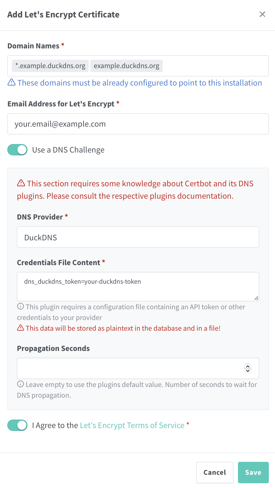

# 📦 Nginx Proxy Manager Docker Compose Stack

This repository provides a self-contained Docker Compose stack to run [Nginx Proxy Manager](https://nginxproxymanager.com/), a modern UI for managing Nginx-based reverse proxies with automatic SSL via Let's Encrypt.

It supports optional ZFS integration for advanced users who wish to mount data volumes onto a ZFS dataset. The stack remains fully usable without ZFS.

---

## 📁 Directory Structure

```bash
tank/
├── docker/
│   ├── compose/
│   │   └── nginx-proxy-manager/    # Git repo lives here
│   │       ├── docker-compose.yml  # Main Docker Compose config
│   │       ├── .env                # Runtime environment variables and secrets (gitignored!)
│   │       ├── env.example         # Example .env file for reference
│   │       ├── env.template        # Optional template
│   │       ├── .woodpecker.yml     # CI/CD pipeline definition for auto-deploy
│   │       ├── README.md           # This file
│   │       └── images/             # Images used in the README.md
│   └── data/
│       └── nginx-proxy-manager/    # Volume mounts and persistent data
```

---

## 🧰 Prerequisites

* Docker Engine
* Docker Compose V2
* Git
* (Optional) ZFS on Linux for dataset management

> ⚠️ **Note:** These instructions assume your ZFS pool is named `tank`. If your pool has a different name (e.g., `rpool`, `zdata`, etc.), replace `tank` in all paths and commands
with your actual pool name.

---

## ⚙️ Setup Instructions

1. **Create the stack directory and clone the repository**

   If using ZFS:
   ```bash
   sudo zfs create -p tank/docker/compose/nginx-proxy-manager
   cd /tank/docker/compose/nginx-proxy-manager
   sudo git clone https://github.com/Vantasin/Nginx-Proxy-Manager.git .
   ```

   If using standard directories:
   ```bash
   mkdir -p ~/docker/compose/nginx-proxy-manager
   cd ~/docker/compose/nginx-proxy-manager
   git clone https://github.com/Vantasin/Nginx-Proxy-Manager.git .
   ```

2. **Create the runtime data directory** (optional)

   If using ZFS:
   ```bash
   sudo zfs create -p tank/docker/data/nginx-proxy-manager
   ```

   If using standard directories:
   ```bash
   mkdir -p ~/docker/data/nginx-proxy-manager
   ```

3. **Configure environment variables**

   Copy and modify the `.env` file:

   ```bash
   sudo cp env.example .env
   sudo nano .env
   sudo chmod 600 .env
   ```

   > Alternatively generate the `.env` file using the `env.template` template with Woodpecker CI's `.woodpecker.yml`.

4. **Start Nginx Proxy Manager**

   ```bash
   docker compose up -d
   ```

---


## 🌐 Access Nginx Proxy Manager

Once running, open your browser to:

```
http://localhost:81
```

Or replace `localhost` with your server’s IP address.

### 🔑 Initial Login Credentials

Use the following default credentials to log in for the first time:

- **Email:** `admin@example.com`
- **Password:** `changeme`

> **Note:** For security purposes, make sure to change the default password immediately after logging in.

---

## 🔒 Secure Access with Wildcard SSL & DuckDNS

To expose **Nginx Proxy Manager** over HTTPS on your own DuckDNS domain (e.g. `example.duckdns.org`), follow these steps:

### 1. Create your DuckDNS entry  
Sign up at [DuckDNS.org](https://www.duckdns.org/) and create a new subdomain (e.g. `example.duckdns.org`).  

### 2. Obtain a wildcard Let’s Encrypt certificate  
1. In the NPM UI, go to **SSL → Add Let’s Encrypt Certificate**.  
2. Under **Domain Names**, enter your `*` wild card and duckdns domains eg.:  
`*.example.duckdns.org` & `example.duckdns.org`
3. Supply your email address and toggle **Use a DNS Challenge**.  
4. Select **DuckDNS** as the DNS provider and paste your DuckDNS token into **Credentials File Content** ensure there are no extra spaces.  
5. Leave **Propagation Seconds** blank (or increase if you see DNS timeout errors).  
6. Agree to the Terms and click **Save**.  

<p align="center">
  
</p>

> **Tip:** using a wildcard cert means any sub-domain (`foo.example.duckdns.org`, `bar.example.duckdns.org`) will be covered.

> **Note:** you can use any domain you want, we just went with DuckDNS because it is free.

### 3. Add Nginx Proxy Manager itself as a secure proxy host  
1. In the NPM UI, click **Proxy Hosts → Add Proxy Host**.  
2. Under **Details**:  
    - **Domain Names**: `nginx.example.duckdns.org`  
    - **Scheme**: `http`  
    - **Forward Hostname / IP**: the local IP of your NPM container (e.g. your host IP address)  
    - **Forward Port**: `81`  
3. Switch to the **SSL** tab:  
    - Check **Enable SSL**  
    - From the **Certificate** dropdown select your `*.example.duckdns.org` certificate  
    - Enable **Force SSL** to redirect all HTTP → HTTPS  
4. Click **Save**.

> **Note:** if you want to self host your services and access them outside of your Local Network Area (LAN) without port forwarding you can use a VPN like [Tailscale](https://tailscale.com/download/linux) that provides Network Address Translation (NAT) Traversal. You simply need to install Tailscale on the host server, create a free account and use your host server's Tailscale IP in the **Forward Hostname / IP** field.

<p align="center">
  
</p>

You can now visit your NPM dashboard securely at `https://nginx.example.duckdns.org`

---

## 🚀 Continuous Deployment with Woodpecker

This project includes a `.woodpecker.yml` pipeline for automated deployment using [Woodpecker CI](https://woodpecker-ci.org/).

When changes are pushed to the Git repository:
1. The pipeline is triggered by the Woodpecker server.
2. The `.env` file is rendered from `env.template` using `envsubst`.
3. The Docker Compose stack is restarted to apply updates.

> ⚠️ **Note:** the CI pipeline may break if Woodpecker CI depends on Nginx Proxy Manager, eg. Nginx Proxy Manager is the proxy host for the Woodpecker CI service.

---

## 🙏 Acknowledgments

- [ChatGPT](https://openai.com/chatgpt) for assistance in generating setup scripts and templates.
- [Docker](https://www.docker.com/) for container orchestration and runtime.
- [`envsubst`](https://man7.org/linux/man-pages/man1/envsubst.1.html) for lightweight environment variable substitution in template files.
- [jc21/nginx-proxy-manager](https://hub.docker.com/r/jc21/nginx-proxy-manager) the official Docker image used in this stack.
- [Nginx Proxy Manager](https://nginxproxymanager.com/) for making reverse proxy management accessible via a clean UI.
- [Tailscale](https://tailscale.com/) for providing seamless, secure mesh networking with automatic NAT traversal using WireGuard.
- [Woodpecker CI](https://woodpecker-ci.org/) for lightweight, self-hosted continuous integration.
- [ZFS](https://openzfs.org/) for advanced local filesystem features, dataset organization, and snapshotting.
